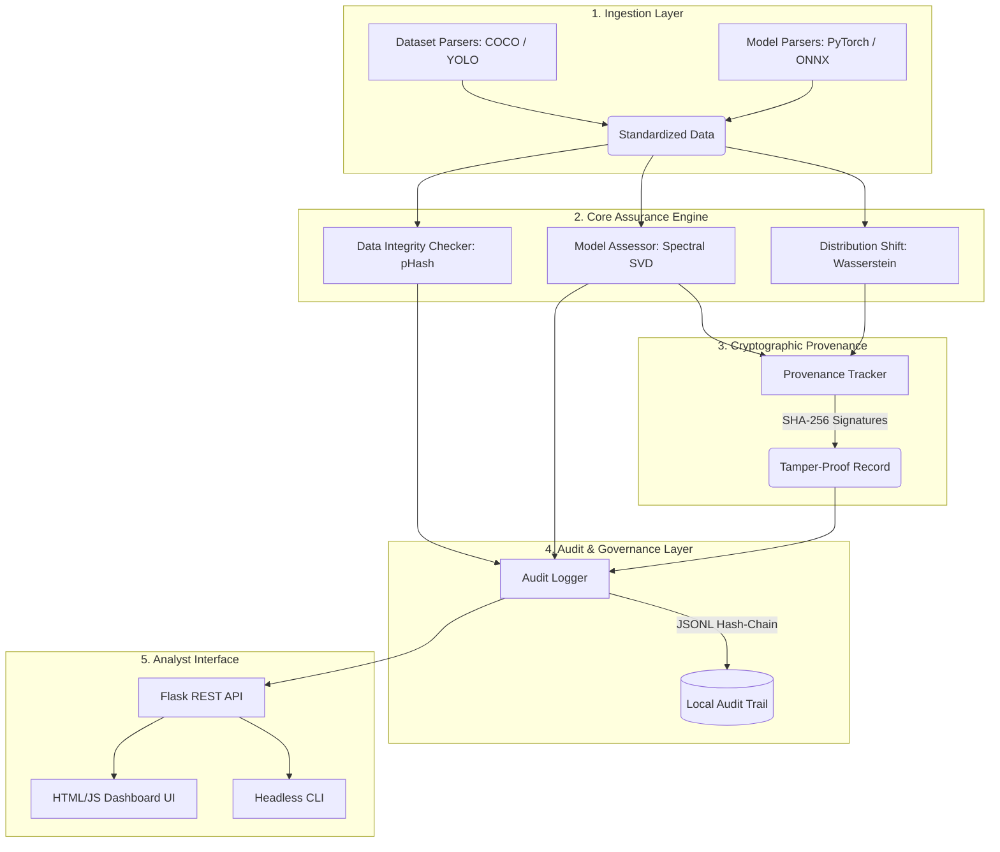

# Zenora Architecture & Design Notes

## System Architecture



Zenora follows a modular, offline-first architecture designed for high security and extensibility. It is composed of five decoupled layers:

### 1. Ingestion Layer (`zenora.ingest`)
Standardizes multi-contributor inputs.
* **Supported Formats:** COCO (JSON), YOLO (TXT), PyTorch (`.pt`), ONNX (`.onnx`).
* **Function:** Normalizes annotations and file paths, gracefully handling missing files or corrupted schemas.

### 2. Core Assurance Engine (`zenora.core`)
The mathematical and ML evaluation layer.
* **Data Integrity:** Calculates MD5 and Perceptual Hashes (Average Hashing). Cross-references visual duplicates against label classes.
* **Model Integrity:** Uses `torch` and `onnx` to extract layer-wise tensors. Computes global and layer-wise standard deviations to flag `|Z-score| > 8` anomalies.
* **Distribution Shift:** Extracts 8x8x8 BGR histograms via OpenCV. Uses Earth Mover's Distance (Wasserstein) to quantify distribution gaps.

### 3. Cryptographic Provenance Layer (`zenora.crypto`)
Ensures data cannot be tampered with after generation.
* **Methodology:** Appends cryptographically secure nonces (`os.urandom`) and Unix timestamps to records.
* **Hashing:** Uses SHA-256 for all digests and signatures.

### 4. Audit & Governance Layer (`zenora.audit`)
* **Tamper-Evident Trail:** Every flag generated by the Core Engine is intercepted by the `AuditLogger`. The logger signs the payload and writes it to a local JSON Lines (JSONL) file. If an attacker modifies the log on disk, the signature check will fail.

### 5. Analyst Interface (`zenora.dashboard` & `zenora.cli`)
* **Dashboard:** A Flask application serving a responsive HTML/CSS/JS frontend. It queries the local `/api/run_pipeline` endpoint to trigger evaluations and `/api/logs` to render the audit trail.
* **CLI:** For automated headless execution in CI/CD environments.

## Assurance-Report Schema (JSON)

The output of the pipeline follows this standardized schema:

```json
{
  "dataset_integrity": {
    "status": "review_required | passed",
    "findings": [
      {
        "issue": "String",
        "evidence": "String",
        "confidence": 0.0 - 1.0,
        "recommendation": "quarantine | review | accept"
      }
    ],
    "dataset": { "num_samples": 0, "exact_duplicates": 0, "label_flips": 0 }
  },
  "model_integrity": {
    "model_digest": "SHA256",
    "status": "critical | warning | passed",
    "findings": [],
    "access_level": "White-Box | Black-Box",
    "assessments": { "fingerprint": { "param_count": 0, "outliers_detected": 0 } }
  },
  "distribution_shift": {
    "shift_score": 0.0 - 1.0,
    "status": "warning | passed",
    "findings": [],
    "test_samples": 0,
    "reference_samples": 0
  },
  "sample_provenance_record": {
    "image_path": "String",
    "image_digest": "SHA256",
    "model_digest": "SHA256",
    "output": {},
    "timestamp": 1234567890.0,
    "nonce": "Hex String",
    "provenance_signature": "SHA256"
  }
}
```
